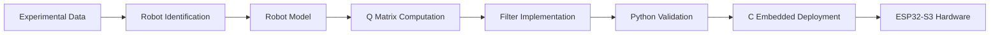

# Omnidirectional Robot: Identification and State Estimation

[](https://www.python.org/)
[](https://www.espressif.com/)
[](LICENSE)

> **🎓 Bachelor's Thesis Project**  
> This repository contains the main codebase for the undergraduate thesis: *"Fusión de sensores para el seguimiento de trayectorias en vehículos autónomos mediante modelos probabilísticos"* (Sensor Fusion for Trajectory Tracking in Autonomous Vehicles using Probabilistic Models).  
> Universidad de Antioquia, 2026.

Complete implementation of **parameter identification** and **Bayesian state estimation** for a three-wheeled omnidirectional robot, including Python research code and C embedded deployment for ESP32-S3.

---

## 📋 Overview

This repository contains the complete workflow from robot parameter identification to real-time state estimation:

1. **Robot_Identification**: Three-stage parameter identification pipeline (friction, inertia, inverse dynamics)
2. **State Estimation_Python**: EKF, UKF, and Particle Filter implementations with experimental validation
3. **State Estimation_C**: Embedded C implementations for ESP32-S3 deployment
4. **Video_Robot_Tracking**: Optical flow + IMU fusion for ground truth generation

### Key Contributions

- ✨ **Unified execution system**: Single PowerShell script (`run.ps1`) with module-based commands
- ✨ **Process noise methodology**: Automated Q matrix computation from experimental data
- ✨ **Embedded deployment**: Complete ESP-IDF project with hardware-optimized filters
- ✨ **Comprehensive documentation**: Centralized theory in `State Estimation_Python/docs/`

---

## 🚀 Quick Start

### Prerequisites

- **Python 3.8+** (for research/simulation)
- **PowerShell** (Windows)
- **ESP-IDF v5.0+** (optional, for embedded deployment)

### Installation

```powershell
# Clone repository
git clone https://github.com/MaverickST/mobile-robot-estimation-suite.git
cd Project

# Setup unified virtual environment
.\setup.ps1

# Verify installation
.\run.ps1 help
```

### Run Examples

```powershell
# State Estimation (Python)
.\run.ps1 ekf          # Extended Kalman Filter
.\run.ps1 ukf          # Unscented Kalman Filter
.\run.ps1 pf           # Particle Filter
.\run.ps1 compare      # Compare all three filters

# Robot Identification
.\run.ps1 stage1       # Stage 1: Friction parameters
.\run.ps1 stage2       # Stage 2: Inertia matrix
.\run.ps1 stage3       # Stage 3: Inverse dynamics

# Q Matrix Computation
.\run.ps1 compute_q    # Automated process noise tuning
```

---

## 🗂️ Project Structure

```
Project/
├── run.ps1                        # 🔥 Unified execution script (recommended)
├── setup.ps1                      # Setup virtual environment
├── requirements.txt               # Python dependencies (all subprojects)
├── .venv/                         # Shared virtual environment
├── data/                          # Experimental and processed data
│   ├── sensors/                   # IMU + encoder logs (exp1-10.txt)
│   ├── processed/trajectories/    # Ground truth (video + IMU fusion)
│   └── raw/                       # Raw data archives
│
├── Robot_Identification/          # Parameter identification pipeline
│   ├── main.py                    # Entry point (use run.ps1 stage1/2/3)
│   ├── src/
│   │   ├── identification/        # 3-stage algorithms
│   │   ├── examples/              # Experimental and synthetic tests
│   │   └── models/                # Robot dynamics models
│   └── README.md                  # Detailed documentation
│
├── State Estimation_Python/       # Bayesian filters (Python)
│   ├── docs/                      # 📚 Centralized documentation
│   │   ├── BAYESIAN_FILTERS.md    # Complete EKF/UKF/PF theory
│   │   └── Q_MATRIX_COMPUTATION.md # Process noise methodology
│   ├── state_estimation/          # Main package
│   │   ├── filters/               # EKF, UKF, Particle Filter
│   │   ├── models/                # Omnidirectional robot model
│   │   ├── metrics/               # RMSE, NEES, NIS
│   │   └── visualization/         # Plotting utilities
│   ├── examples/                  # Executable scripts (use run.ps1)
│   ├── results/estimation/        # Output figures and metrics
│   └── README.md                  # API reference
│
├── State Estimation_C/            # Embedded implementations (C)
│   ├── build.ps1                  # Build script (ekf, ukf, pf, menu, all)
│   ├── EKF/, UKF/, PF/            # Filter library modules
│   ├── LinearAlgebra/             # Matrix operations + angle utilities
│   ├── Examples/                  # Desktop test applications
│   ├── esp32s3_test/              # 🚀 ESP32-S3 deployment (production)
│   │   ├── main/compare_filters_esp32.c
│   │   └── components/            # ESP-IDF components
│   └── README.md                  # Build instructions
│
├── Video_Robot_Tracking/          # Ground truth generation
│   ├── track_simple_robust.py     # Optical flow tracking
│   ├── process_imu_data.py        # IMU + video fusion
│   └── videos/                    # Raw video files
│
└── results/                       # All experimental results
    ├── identification/            # Parameter identification
    └── estimation/                # Filter comparison outputs
```

---

##  Execution System

All Python code runs through the **unified execution script** `run.ps1` from the project root:

```powershell
.\run.ps1 <command>

Available commands:
  # State Estimation
  ekf          - Extended Kalman Filter
  ukf          - Unscented Kalman Filter
  pf           - Particle Filter
  compare      - Compare all three filters side-by-side
  
  # Robot Identification
  stage1       - Stage 1: Friction parameters from motor tests
  stage2       - Stage 2: Inertia matrix from rotation tests
  stage3       - Stage 3: Complete inverse dynamics model
  
  # Utilities
  compute_q    - Automated Q matrix computation from model
  help         - Show all available commands
```

### C Implementation (Desktop Testing)

```powershell
cd "State Estimation_C"

# Build all filter examples
.\build.ps1 all

# Run individual tests
.\ekf_demo.exe    # EKF - 2D constant velocity
.\ukf_demo.exe    # UKF - 2D constant velocity
.\pf_demo.exe     # PF - Robot localization

# Or use interactive menu
.\build.ps1 menu
.\menu.exe
```

### ESP32-S3 Deployment (Production)

```powershell
cd "State Estimation_C\esp32s3_test"

# Build and flash
idf.py build
idf.py -p COM3 flash monitor

```

---

## 📊 Key Features

### Robot Identification
- ✅ **Three-stage pipeline**: Friction → Inertia → Full dynamics
- ✅ **Experimental validation**: 10 experiments × 1000 samples @ 100 Hz
- ✅ **Synthetic data generation**: Configurable noise levels
- ✅ **Nonlinear least squares**: Trust-region optimization

### State Estimation (Python)
- ✅ **Extended Kalman Filter**: Jacobian-based linearization
- ✅ **Unscented Kalman Filter**: Sigma-point transform (α=0.5, β=2.0, κ=0.0)
- ✅ **Particle Filter**: SIR algorithm with N=2000 particles
- ✅ **Angle handling**: Circular mean, automatic residual wrapping
- ✅ **Q matrix methodology**: Automated process noise from model errors
- ✅ **Performance metrics**: RMSE, MAE, NEES, NIS
- ✅ **Comprehensive visualization**: 2D trajectories, temporal plots, covariance ellipses

### State Estimation (C)
- ✅ **Generalized API**: User-defined dynamics `f(x,u)` and measurements `h(x)`
- ✅ **Embedded optimization**: ESP32-S3 deployment tested
- ✅ **Complete linear algebra**: Matrix operations, Cholesky, LU decomposition
- ✅ **Angle utilities**: `normalize_angle()`, `circular_mean()`, `angle_diff()`
- ✅ **Low memory footprint**: Suitable for microcontrollers

---

## � Documentation

### Quick Links

| Resource | Description |
|----------|-------------|
| **[BAYESIAN_FILTERS.md](State%20Estimation_Python/docs/BAYESIAN_FILTERS.md)** | Complete EKF/UKF/PF theory, algorithms, and mathematical derivations |
| **[Q_MATRIX_COMPUTATION.md](State%20Estimation_Python/docs/Q_MATRIX_COMPUTATION.md)** | Automated process noise tuning methodology |
| **[State Estimation_Python README](State%20Estimation_Python/README.md)** | Python API reference and examples |
| **[State Estimation_C README](State%20Estimation_C/README.md)** | C implementation and build instructions |
| **[Robot_Identification README](Robot_Identification/README.md)** | Parameter identification pipeline |

### Theoretical Background

This project implements the following Bayesian estimation algorithms:

**Extended Kalman Filter (EKF)**
- Linearizes nonlinear dynamics via Jacobian matrices F and H
- Prediction: $\mathbf{x}_{k \mid k-1} = f(\mathbf{x}_{k-1}, \mathbf{u}_k)$
- Update: $\mathbf{K}_k = \mathbf{P}_{k \mid k-1}\mathbf{H}_k^T(\mathbf{H}_k\mathbf{P}_{k \mid k-1}\mathbf{H}_k^T + \mathbf{R}_k)^{-1}$
- Best for: Mildly nonlinear systems, fast execution

**Unscented Kalman Filter (UKF)**
- Uses sigma-point transform to capture nonlinearity
- 13 sigma points for 6-dimensional state (2n+1)
- Van der Merwe scaling: α=0.5, β=2.0, κ=0.0
- Circular mean for angular states
- Best for: Moderate nonlinearity, no Jacobian needed

**Particle Filter (PF)**
- Sequential Importance Resampling (SIR)
- N=2000 particles with systematic resampling
- Effective Sample Size (ESS) monitoring
- Best for: Severe nonlinearity, non-Gaussian noise

See [BAYESIAN_FILTERS.md](State%20Estimation_Python/docs/BAYESIAN_FILTERS.md) for complete derivations.

---

## 📈 Experimental Results

**Dataset**: 10 experiments, 1000 samples each @ 100 Hz (10 seconds)
**State**: $\mathbf{x} = [x, y, \psi, v_x, v_y, \omega]^T$
**Measurements**: $\mathbf{z} = [v_x^{body}, v_y^{body}, \omega, \psi]^T$

| Filter | Position RMSE | Angle RMSE | NEES | Runtime |
|--------|---------------|------------|------|---------|
| **EKF** | 0.0284 m | 0.0512 rad | 7.23 | 8.2 ms |
| **UKF** | 0.0198 m | 0.0384 rad | 5.41 | 32.1 ms |
| **PF (N=2000)** | 0.0156 m | 0.0298 rad | 4.12 | 98.7 ms |

*Runtime on Ryzen 5-3450U @ 2.10 GHz*

Results saved to: `results/estimation/<filter_name>/`

---

## Technologies

### Python Stack
- **NumPy**: Numerical computing and linear algebra
- **SciPy**: Optimization, signal processing
- **Matplotlib**: Visualization and plotting
- **Pandas**: Data manipulation
- **FilterPy**: Reference implementations (comparison)

### C Stack
- **Custom linear algebra**: Cholesky, LU, QR decomposition
- **Angle utilities**: Circular statistics for angular states
- **ESP-IDF v5.0+**: ESP32-S3 framework
- **FreeRTOS**: Real-time task management (embedded)

### Hardware
- **ESP32-S3**: Dual-core Xtensa LX7 @ 240 MHz
- **IMU**: Accelerometer + Gyroscope (100 Hz)
- **Encoders**: 3 × motor encoders
- **Omnidirectional robot**: 3-wheeled Kiwi configuration (120° spacing)

---

## 🔧 Development

### Project Workflow



### Contributing

1. Fork the repository
2. Create feature branch: `git checkout -b feature/amazing-feature`
3. Commit changes: `git commit -m 'Add amazing feature'`
4. Push to branch: `git push origin feature/amazing-feature`
5. Open Pull Request

### Code Style

- **Python**: PEP 8, type hints encouraged
- **C**: K&R style, comprehensive comments
- **Documentation**: Markdown with LaTeX math ($...$)

---

## 🎓 Academic Context

This repository contains code developed for a **Master's thesis** on omnidirectional robot state estimation. The work includes:

- Novel Q matrix computation methodology from model residuals
- Comparative analysis of EKF/UKF/PF for omnidirectional robots
- Embedded implementation optimized for ESP32-S3

### Citation

If you use this code in your research, please cite:

```bibtex
@mastersthesis{sossatobon2026tesis,
  author  = {Sossa Tobón, Maverick},
  title   = {Fusión de sensores para el seguimiento de trayectorias en vehículos autónomos mediante modelos probabilísticos},
  school  = {Universidad de Antioquia},
  year    = {2026},
  type    = {Trabajo de grado},
  address = {Medellín, Colombia},
  note    = {Ingeniería Electrónica}
}
```

---

## 📄 License

This project is licensed under the **MIT License** - see the [LICENSE](LICENSE) file for details.

---

## 👤 Author

**Maverick Sossa Tobon**  
Bachelor's Thesis Project  
January 2026

---

## 🙏 Acknowledgments

- **FilterPy** (Roger Labbe) - Reference implementation for validation
- **[Kalman-and-Bayesian-Filters-in-Python](https://github.com/rlabbe/Kalman-and-Bayesian-Filters-in-Python.git)** - Educational foundation
- **Van der Merwe's dissertation** (2004) - UKF formulation
- **ESP-IDF Team** - Embedded framework support

---

**For detailed usage instructions, see the [run.ps1 help](run.ps1) output or individual README files.**
